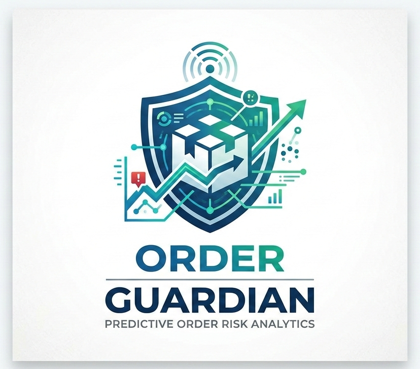
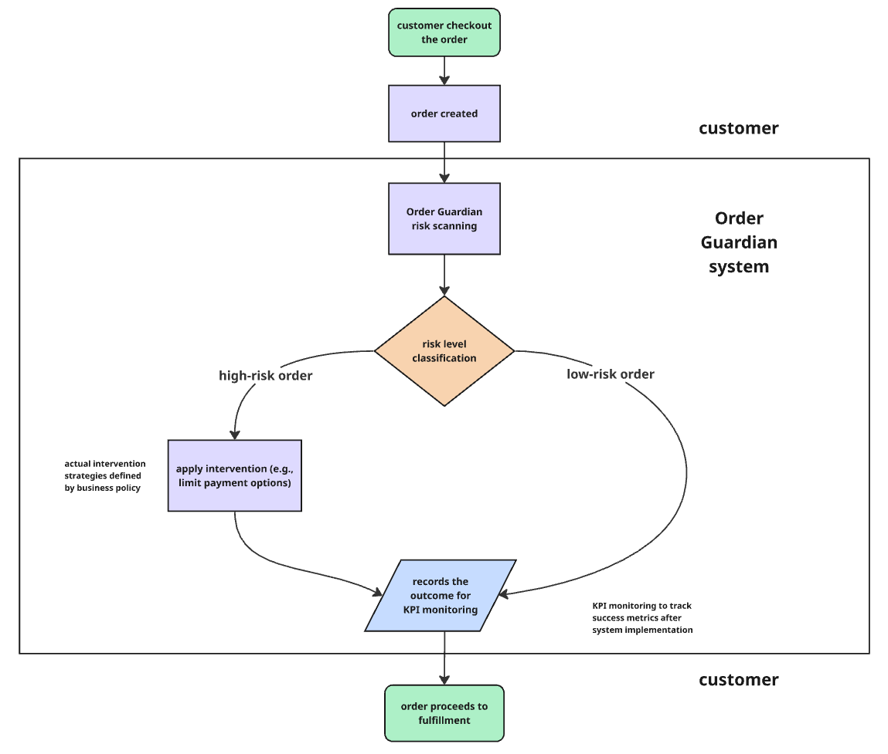

<p align="center">
  
</p>

<p align="center">
  <i>"Detecting Risk, Delivering Trust"</i>
</p>

# Order Guardian: Predictive Order Cancellation Risk System    
A collaborative end-to-end data project combining Data Engineering, Data Analysis, and Data Science to develop a predictive analytics framework for identifying high-risk e-commerce orders.

## Repository Outline

```
├── dags/                   # Airflow DAG for pipeline orchestration
├── data/
│ ├── raw/                  # Raw transactional datasets
│ └── cleaned/              # Processed datasets used for analysis and modeling
├── src/                    # Data pipeline scripts and project assets
├── EDA/                    # Exploratory Data Analysis notebooks
├── Predict/                # Machine learning modeling notebooks and trained model
├── deployment/             # Streamlit / HuggingFace deployment scripts
├── init/                   # Database initialization scripts
├── business-overview.md    # Business context and problem overview
├── docker-compose.yml      # Airflow environment configuration
├── requirements.txt        # Python dependencies
└── README.md               # Project overview explanation
```

---

## Project Overview

Order Guardian is a **predictive analytics system** designed to identify and monitor high-risk e-commerce orders before operational resources are fully allocated.

The system identifies **high-risk orders before payment or fulfillment processes begin**, allowing businesses to apply preventive policies during the checkout process. Example policies such as limiting certain payment incentives or delivery options, the preventive policies is to reduce operational losses caused by order cancellations. Through this approach, companies can reduce operational waste from cancelled orders while maintaining a smooth purchasing experience for most customers.

This project integrates **Data Engineering, Data Analysis, and Data Science workflows** to build a complete data-driven solution.

---

## Project Backgrounds

Indonesia's digital economy continues to grow rapidly, with e-commerce as a major contributor to national Gross Merchandise Value (GMV). According to the *Google, Temasek, and Bain & Company e-Conomy SEA 2025 report*, Indonesia’s e-commerce GMV reached approximately **US$71 billion**, growing at double-digit rates annually.

As online transactions scale across cities, retailers process thousands of daily orders across various product categories, shipping methods, and payment options. However, this growth introduces operational challenges, one of which is **order cancellations**.

Order cancellations can lead to:

- Lost revenue opportunities  
- Inefficient inventory allocation  
- Reverse logistics and shipping costs (especially in COD transactions)

Most companies handle cancellations **reactively**, after logistics resources have already been allocated. This project explores how **predictive analytics can identify high-risk orders in earlier stage**, and enabling proactive operational decisions.

Dataset Source:  
→ [Brazilian E-Commerce Public Dataset by Olist](https://www.kaggle.com/datasets/olistbr/brazilian-ecommerce)

---

## Problem Statement

Although transactional data contains useful signals related to order completion behavior, many companies do not yet have systems that transform raw operational data into predictive risk monitoring tools. As a result, cancellations are often addressed **after fulfillment processes have already begun**, leading to operational inefficiencies and unnecessary costs. This project explores how a data team can build a **predictive order risk scoring system** that enables earlier identification of cancellation risks.

---

## Project Objectives

This project demonstrates an end-to-end data workflow consisting of three main components:

### Data Engineering

- Build an automated ETL pipeline orchestrated with Apache Airflow  
- Perform data validation and quality checks during the transformation process  
- Transform and aggregate raw transactional data into analytical-ready datasets  
- Create structured datasets and data marts to support downstream analytics and modeling

### Data Analysis

- Conduct exploratory data analysis (EDA) to understand cancellation patterns
- Identify behavioral and transactional signals related to order cancellations
- Generate candidate features and modeling hypotheses
- Provide analytical insights to support predictive modeling

### Data Science

- Formulate cancellation prediction as a **binary classification problem**
- Perform feature engineering and model training
- Address severe class imbalance during model development
- Compare multiple machine learning algorithms
- Optimize model performance through tuning and evaluation
- Deploy the selected model for **real-time cancellation risk scoring**

---

## Methods

The Order Guardian system was developed through an end-to-end analytical workflow consisting of four major stages:

1. **Data Ingestion & Processing**

Raw transactional datasets are ingested through an automated pipeline orchestrated using Apache Airflow. During this stage, the pipeline performs data validation, cleaning, and aggregation to transform raw operational data into structured analytical datasets.

2. **Exploratory Analysis**

Exploratory Data Analysis (EDA) is conducted to understand cancellation behavior, identify meaningful transactional signals, and generate candidate features for predictive modeling.

3. **Predictive Modeling**

Cancellation prediction is formulated as a binary classification problem. Multiple machine learning algorithms are trained and evaluated to identify the most suitable model for detecting high-risk orders.

4. **Model Deployment**

The selected model is deployed as an interactive application capable of generating **real-time cancellation risk scores** for incoming order transactions.

---

## System Overview

Order Guardian integrates predictive analytics into the **order checkout workflow**.

After a customer creates an order, the system performs **risk scoring before payment or fulfillment processes proceed**.

Orders identified as high-risk may trigger preventive operational policies such as:

- Limiting promotional voucher usage  
- Restricting certain payment methods (e.g., COD)  
- Restricting free-shipping incentives  

This allows businesses to **reduce operational waste while maintaining normal purchasing flow for most customers**.

---

## System Architecture

<p align="center">
  
</p>

---

## Project Outputs

### Exploratory Data Analysis Dashboard
Interactive dashboard for analyzing cancellation patterns.

Tableau Dashboard: [Dashboard-Link](https://public.tableau.com/app/profile/maulana.malik.fajri/viz/OrderGuardian/Dashboard1)

### Predictive Model Demo

Interactive web application demonstrating the Order Guardian system.

The application includes:
- Predictive cancellation risk scoring user-input demo
- Exploratory data insights
- Data pipeline monitoring overview

HuggingFace Space: [Space-Link](https://huggingface.co/spaces/Heizsenberg/order-guardian)

---

## Presentation Slides

Project presentation explaining business context, system architecture, and modeling approach:

https://docs.google.com/presentation/d/17xGm80vCwvWv92I0NEuK2LxuqmuJVPEYhLiWFFzEE04/edit?usp=sharing

---

## Tech Stacks

### Programming Language
- Python 3.9

### Python libraries:
- `pandas`
- `numpy`
- `matplotlib`
- `seaborn`
- `scipy`
- `scikit-learn==1.6.1`
- `feature_engine==1.8.3`
- `phik==0.12.5`
- `xgboost==2.1.4`
- `lightgbm==4.6.0`
- `shap==0.47.2`
- `great_expectations==0.18.22`
- `streamlit==1.44.0`
- `pendulum==3.1.0`
- `sqlalchemy==1.4.54`
- `python-dotenv`

To install the required dependencies:
```
pip install -r requirements.txt
```

### Data Engineering:

- **Apache Airflow 2.7.3** (workflow orchestration)
- **Docker** (containerized environment)
- **PostgreSQL 13** (relational database)

### Data Visualization:

- **Tableau** (interactive dashboard)

### Deployment:

- **HuggingFace Spaces** (streamlit based)